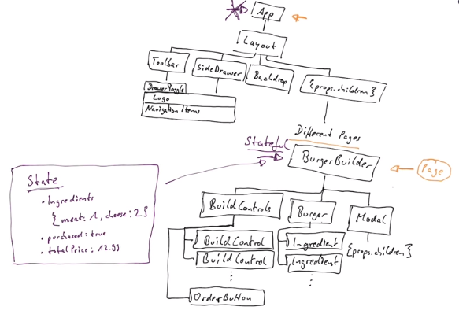
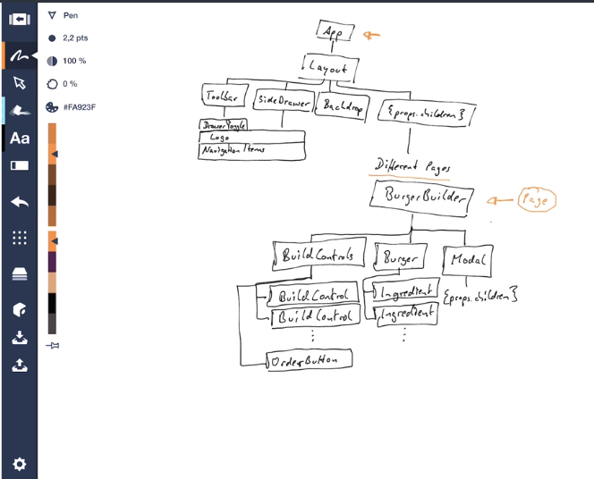
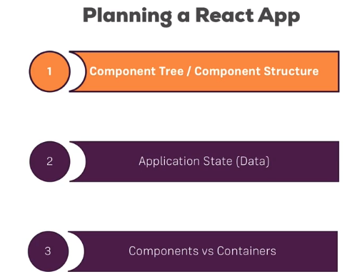

# 27 Next Steps and Course Roadmap
# 26 Bonus: Building the Burger CSS
# 25 Bonus: A Brief Introduction to Redux Saga
# 24 Bonus: Animations in React Apps
# 23 Bonus: Next.js
# 22 Bonus: Working with Webpack
# 21 Deploying the App to the Web
# 20 Testing
# 19 Improving our Burger Project
# 18 Adding Authentication to our Burger Project
# 17 Redux Advanced: Burger Project
# 16 Redux Advanced
# 15 Adding Reduc to our Project
# 14 Redux
# 13 Forms and Form Validation
# 12 Adding Routing to our Burger Project
# 11 Multi-Page-Feeling in a Single-Page-App: Routing
# 10 Burger Builder Project: Accessing a Server
# 9 Reaching out to the Web (Http / Ajax)

# 8  Real App: The Burger Builder (Basic Version)

## 135 Using a Logo

## 133 Adding the Price

## 132 Implementing the button component

## 131 Adding a custom Button Component

## 130 Implementing the Backdrop Component

## 129 Showing and Hiding the Modal with Animation

## 128 Creating the Order Summary Modal

## 127 Adding the Order Button
- insert a Modal
- checkout Button
- Summary

## 126 Displaying and Updating the Burger Price
```html
<strong>{props.price.toFixed(2)}
```

## 125 Removing Ingredients savely

## 124 Connecting State to Build Controls
- name global constants in capital letters
- onClick handler is from react

## 123 Outputting Multiple Build Controls

## 122 Adding the Build Control Component

## 121 Calculating the Ingredient Sum Dynamically
- make use of reduce https://developer.mozilla.org/en-US/docs/Web/JavaScript/Reference/Global_Objects/Array/reduce
- make use of map https://developer.mozilla.org/en-US/docs/Web/JavaScript/Reference/Global_Objects/Array/map

## 120 Outputting Burger Ingredients Dynamically
- transform object into array
- ```object.keys(props.ingredients)```
- ```Array()``` method for 
```javascript
const transformedIngredients =
    Object.keys(props.ingredients).map((igKey) => {
        return [...Array(props.ingredients[igKey])].map((_, i) => {
            return <BurgerIngredient key={igKey + i} type={igKey} />
        });
    });
```

## 119 Starting the Burger Component
- 1.2 scales based on the user selected size

## 118 Adding Prop Type Validation
- prop-types can only be used on class components

## 117 Adding a Dynamic Ingredient Component
- good practise to create granular components and not big chunks

## 116 Starting Implementation of The Burger Builder

## 115 Creating a Layout Component
- seperate component for layout
- use higher order compoent [Aux](code/src/hoc/Aux.js)
- added font Open Sans

## 114 Setting up the Project
- want to use css modules so we have to **eject** the project
- other fond Open Sans (bold 700)
- https://fonts.google.com/

## 113 Planning the State


## 112 Planning our App - Layout and Component Tree


## 111 Planning an App in React - Core Steps

1. Component Tree / Component Structure
2. Application State (Data)
3. Components vs Containers
    - stateful vs functional

## 110 Module Introduction (8  Real App: The Burger Builder (Basic Version)
- time to build a real react application
- learn all concepts

# 7 Diving Deeper into Components & React Internals

## 109 Useful Resources & Links (7 Diving Deeper into Components & React Internals)
- State & Lifecycle: https://reactjs.org/docs/state-and-lifecycle.html
- PropTypes: https://reactjs.org/docs/typechecking-with-proptypes.html
- Higher Order Components: https://reactjs.org/docs/higher-order-components.html
- Refs: https://reactjs.org/docs/refs-and-the-dom.html

## 108 Wrap Up (7 Diving Deeper into Components & React Internals)
- a lot of theory
- its important to understand how it works
- hooks/lifecycles, ...

## 107 The "memo" Method (React 16.6)
- how to effectivly rerender your component
- PureComponent: only rerender when something changed
- now you can also optimize functional components
```javascript
export default React.memo(cockpit);
```
- now only when props really change, the component will be rerendered
- props will only be compared on a shallow level (no deep checking is done) but if toplevel value changed, than it is rerendered
- it does not always makes sense
    - if a component must be rerendered every time

## 106 Updated Lifecycle Hooks (React 16.3)
- discourage of use of some hooks
  - componentWillMount
  - componentWillUpdate
  - compoenntWillReceiveProps
- were used on a wrong way
- 2 new ones
    - ```static getDerivedStateFromProps(nextProps, prevState)```
        - do not overuse
    - ```getSnapshotBeforeUpdate()```
        - use for example to save current scrolling posistion (see official docs for example)
- you shouldnt couple your state to props

## 105 More on the Context API (React 16.6)
- new feature, easier usage
- 
```javascript
// App.js
toggleAuth = () => {
    this.setState(prevState => {
        return {
            isAuth: !prevState.isAuth
        }
    })
}

// Login.js
import AuthContext from '../auth-context'
class Login extends Component {
    static contextType = AuthContext;

    render() {
        (
            <button onClick={this.context.toggleAuth}>
                {this.context.isAuth = 'Logout' : 'Login'}
            </button>
        )
    }
}

// auth-context.js
export default React.createContext({
    isAuth: false,
    toggleAuth: () => {}
})
```


## 104 The Context API (React 16.3)
- a greate tool to pass global state around in your app
- works with providers or consumers
  - in app.js we provide
    - to all child components, no matter on which level they are
  - in others we consume
- we can use a component
```javascript

// Provide
export const AuthContext = React.createContext(false);
<AuthContext.Provider value={this.state.authenticated}>
    {persons}
</AuthContext.Provider>

// Consume
import { AuthContext } from '../../../containers/App'
<AuthContext.Consumer>
    {auth => auth ? <p>I'm authenticated</p> : null}
</AuthContext.Consumer>
```

## 103 More on the React ref API (16.3)

### new way of rendering references
```javascript
// in constructor
this.inputElement = React.createRef();

// usage in element
ref={this.inputElement}
```

### forward Refs
- a tunnel through the higher order components
- forward refs are only used for higher order components which want to tunnel
- usually one uses normal refs
```javascript
const withClass = (WrappedComponent, className) => {
    const WithClass = class extends Component {
        render() {
            return (
                <div className={className}>
                    <WrappedComponent
                        ref={this.props.forwardedRef}
                        {...this.props} />
                </div>
            )
        }
    }

    return React.forwardRef((props, ref) => {
        return <WithClass {...props} forwardedRef={ref} />;
    });
}
```


## 102 Using References (“ref”) → focusing
- References are only available in stateful components
- Don't get lazy and it use for other things
  - focus()
  - Media playback

## 101 Available PropTypes
- https://reactjs.org/docs/typechecking-with-proptypes.html

### types
```javascript
import PropTypes from 'prop-types';
 
MyComponent.propTypes = {
  // You can declare that a prop is a specific JS primitive. By default, these
  // are all optional.
  optionalArray: PropTypes.array,
  optionalBool: PropTypes.bool,
  optionalFunc: PropTypes.func,
  optionalNumber: PropTypes.number,
  optionalObject: PropTypes.object,
  optionalString: PropTypes.string,
  optionalSymbol: PropTypes.symbol,
 
  // Anything that can be rendered: numbers, strings, elements or an array
  // (or fragment) containing these types.
  optionalNode: PropTypes.node,
 
  // A React element.
  optionalElement: PropTypes.element,
 
  // You can also declare that a prop is an instance of a class. This uses
  // JS's instanceof operator.
  optionalMessage: PropTypes.instanceOf(Message),
 
  // You can ensure that your prop is limited to specific values by treating
  // it as an enum.
  optionalEnum: PropTypes.oneOf(['News', 'Photos']),
 
  // An object that could be one of many types
  optionalUnion: PropTypes.oneOfType([
    PropTypes.string,
    PropTypes.number,
    PropTypes.instanceOf(Message)
  ]),
 
  // An array of a certain type
  optionalArrayOf: PropTypes.arrayOf(PropTypes.number),
 
  // An object with property values of a certain type
  optionalObjectOf: PropTypes.objectOf(PropTypes.number),
 
  // An object taking on a particular shape
  optionalObjectWithShape: PropTypes.shape({
    color: PropTypes.string,
    fontSize: PropTypes.number
  }),
 
  // You can chain any of the above with `isRequired` to make sure a warning
  // is shown if the prop isn't provided.
  requiredFunc: PropTypes.func.isRequired,
 
  // A value of any data type
  requiredAny: PropTypes.any.isRequired,
 
  // You can also specify a custom validator. It should return an Error
  // object if the validation fails. Don't `console.warn` or throw, as this
  // won't work inside `oneOfType`.
  customProp: function(props, propName, componentName) {
    if (!/matchme/.test(props[propName])) {
      return new Error(
        'Invalid prop `' + propName + '` supplied to' +
        ' `' + componentName + '`. Validation failed.'
      );
    }
  },
 
  // You can also supply a custom validator to `arrayOf` and `objectOf`.
  // It should return an Error object if the validation fails. The validator
  // will be called for each key in the array or object. The first two
  // arguments of the validator are the array or object itself, and the
  // current item's key.
  customArrayProp: PropTypes.arrayOf(function(propValue, key, componentName, location, propFullName) {
    if (!/matchme/.test(propValue[key])) {
      return new Error(
        'Invalid prop `' + propFullName + '` supplied to' +
        ' `' + componentName + '`. Validation failed.'
      );
    }
  })
};
```
### Requiring Single Child
- With PropTypes.element you can specify that only a single child can be passed to a component as children.
```javascript
import PropTypes from 'prop-types';
 
class MyComponent extends React.Component {
  render() {
    // This must be exactly one element or it will warn.
    const children = this.props.children;
    return (
      <div>
        {children}
      </div>
    );
  }
}
 
MyComponent.propTypes = {
  children: PropTypes.element.isRequired
};
```

### Default Prop Values
- You can define default values for your props by assigning to the special defaultProps property:
```javascript
class Greeting extends React.Component {
  render() {
    return (
      <h1>Hello, {this.props.name}</h1>
    );
  }
}
 
// Specifies the default values for props:
Greeting.defaultProps = {
  name: 'Stranger'
};
 
// Renders "Hello, Stranger":
ReactDOM.render(
  <Greeting />,
  document.getElementById('example')
);
```
- The defaultProps will be used to ensure that this.props.name will have a value if it was not specified by the parent component. The propTypes typechecking happens after defaultProps are resolved, so typechecking will also apply to the defaultProps
